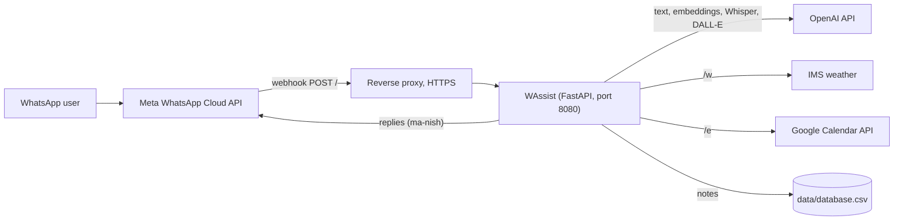

# WAssist

[](LICENSE)
[](https://hub.docker.com/r/techblog/wassist)

WAssist is a self-hosted personal assistant bot for WhatsApp. It receives messages through the
official **WhatsApp Cloud API** (Meta) and answers them with OpenAI models. It can also save personal
notes and later search them or answer questions about them, transcribe voice messages with
Whisper, draw images with DALL-E, show the Israeli weather forecast, list upcoming Google Calendar
events, and report your OpenAI spending. Only phone numbers you allow can use the text commands.

The `examples` folder has screenshots of the bot in use.

> [!WARNING]
> **Several features no longer work.** WAssist uses the legacy `openai==0.28.1` Python SDK and
> models that OpenAI has since retired:
>
> - **Chat (plain messages) and `/q`** call the Completions API with `text-davinci-003`, which OpenAI
>   retired in January 2024. Both now reply with `aw snap something went wrong`.
> - **`/d` (image generation)** calls `openai.Image.create` without a model, so it uses DALL-E 2.
>   DALL-E 2 and 3 were removed from the OpenAI API on 2026-05-12, so this command fails too.
> - **`/c` (costs)** reads `https://api.openai.com/dashboard/billing/usage`, an undocumented
>   dashboard endpoint that no longer accepts API keys, so it is probably broken as well.
>   <!-- TODO: verify -->
>
> Saving and searching notes (`/s`, `/f`, via `text-embedding-ada-002`), voice transcription
> (`whisper-1`), weather and calendar do not depend on the retired models. None of them has been
> re-tested recently. <!-- TODO: verify -->

## Table of contents

- [Features](#features)
- [Screenshots](#screenshots)
- [How it works](#how-it-works)
- [Requirements](#requirements)
- [Installation](#installation)
- [Configuration](#configuration)
- [Usage](#usage)
- [Data storage](#data-storage)
- [Troubleshooting](#troubleshooting)
- [Security and privacy](#security-and-privacy)
- [Development](#development)
- [Contributing](#contributing)
- [License](#license)
- [Acknowledgments](#acknowledgments)

## Features

- **Chat with GPT**: any text that does not start with `/` is sent to the OpenAI Completions API
  (`text-davinci-003`, now retired; see the warning above).
- **Personal notes**: `/s` saves a note together with its OpenAI embedding (`text-embedding-ada-002`).
  `/f` finds the 3 most similar notes, and `/q` answers a question from them.
- **Voice message transcription**: audio messages are converted to WAV with `pydub`/`ffmpeg` and
  transcribed with Whisper (`whisper-1`). Whisper detects the language, so Hebrew and other languages work.
- **Image generation**: `/d` draws a 1024x1024 image with DALL-E and sends it back (broken; see above).
- **Weather**: `/w` sends a four-day national forecast in Hebrew from the Israel Meteorological
  Service ([IMS](https://ims.gov.il/he)), using the [weatheril](https://pypi.org/project/weatheril/) library.
- **Google Calendar**: `/e` lists the events of the next 24 hours from one calendar, read-only,
  using a Google service account.
- **OpenAI costs**: `/c` shows your estimated OpenAI spending for today, yesterday, the last 7 days
  and the last 30 days.
- **PDF import**: PDF documents you send are converted to text files. Nothing reads these files yet.
- **Allowlist**: only the numbers in `ALLOWED_NUMBERS` can use text commands and send PDFs.

## Screenshots

### Commands menu


### Chatting with GPT


### Saving a note and asking about it


### Using DALL-E


### Weather forecast


### Estimated costs


The screenshots show older versions of the bot. For example, the help menu has since gained `/w`,
`/e` and `/c`.

## How it works

WAssist is a single [FastAPI](https://fastapi.tiangolo.com/) app (`app/app.py`) that Meta calls as
a webhook. The [ma-nish](https://pypi.org/project/ma-nish/) library parses the webhook payload and
sends the replies through the WhatsApp Cloud API. `app/commandhandler.py` handles the commands.



1. Meta verifies the webhook with `GET /`. WAssist answers with `hub.challenge` when
   `hub.verify_token` matches `VERIFY_TOKEN`.
2. Meta posts each incoming message to `POST /`. WAssist marks it as read, then:
   - **text** from an allowed number: runs the command (or sends the text to GPT) and replies with
     text, or with an image for `/d`;
   - **PDF document** from an allowed number: downloads it and saves its text under `documents/`;
   - **audio** from any number: transcribes it with Whisper and replies with the text;
   - anything else is only logged.

## Requirements

- A Meta developer account with a **WhatsApp Cloud API** app: an access token, a phone number ID,
  and a webhook subscribed to the `messages` field. The
  [ma-nish page](https://pypi.org/project/ma-nish/) explains the setup.
- A public **HTTPS** URL that forwards to WAssist, because Meta only calls HTTPS webhooks. Use a
  reverse proxy such as [Nginx](https://nginx.org/) or [Traefik](https://traefik.io/), or a
  [Cloudflare Tunnel](https://www.cloudflare.com/products/tunnel/).
- An **OpenAI API key**.
- Optional, for `/e`: a Google Cloud **service account** JSON key with the Google Calendar API
  enabled, and the calendar shared with the service account's email address.
- To run from source: Python 3.11 or older (the pinned `pandas==1.5.3` has no wheels for Python
  3.12 and later) and `ffmpeg` (used by `pydub` for audio conversion).

## Installation

### Docker Compose

```yaml
services:
  wassist:
    image: techblog/wassist:latest
    container_name: wassist
    restart: always
    ports:
      - "8080:8080"
    environment:
      - TOKEN=              # WhatsApp Cloud API access token
      - PHONE_NUMBER_ID=    # WhatsApp phone number ID
      - VERIFY_TOKEN=       # any string; enter the same value in the Meta webhook settings
      - OPENAI_KEY=         # OpenAI API key
      - ALLOWED_NUMBERS=    # comma-separated, e.g. 972501234567,972541234567
      # Optional, for /e:
      # - CAL_CREDS=/app/data/service-account.json
      # - CALENDAR_ID=
    volumes:
      - ./wassist:/app/data
```

```bash
docker compose up -d
```

The app listens on port **8080** inside the container. The `docker-compose.yaml` in this
repository maps `80:7020`, which does not match. Use `<host port>:8080` instead.

### Docker run

```bash
docker run -d --name wassist --restart always \
  -p 8080:8080 \
  -e TOKEN=... \
  -e PHONE_NUMBER_ID=... \
  -e VERIFY_TOKEN=... \
  -e OPENAI_KEY=... \
  -e ALLOWED_NUMBERS=972501234567 \
  -v "$(pwd)/wassist:/app/data" \
  techblog/wassist:latest
```

Published images are listed under [Development](#published-images).

### From source (systemd service)

Use Python 3.11 or older. Install into a virtual environment: most current distributions mark
the system Python as externally managed ([PEP 668](https://peps.python.org/pep-0668/)), so a plain
`pip3 install` fails there. Pin `numpy<2`, because `pandas==1.5.3` does not work with NumPy 2.

```bash
git clone https://github.com/t0mer/WAssist
cd WAssist
python3.11 -m venv .venv
.venv/bin/pip install -r requirements.txt "numpy<2"
mkdir -p app/data
```

`requirements.txt` does not include some packages that the code imports: `google-api-python-client`
and `google-auth` (for `gcal.py`), `pytesseract`, `PyPDF2` and `pdfplumber` (for
`commandhandler.py`), and `tenacity` (imported by `openai.embeddings_utils`). Install them too, or
the app will fail to start:
<!-- TODO: verify the exact package set on a clean install -->

```bash
.venv/bin/pip install google-api-python-client google-auth pytesseract PyPDF2 pdfplumber tenacity
```

Run the app from the `app` folder, because it stores its data relative to the working directory:

```bash
cd app
../.venv/bin/python app.py
```

To run it as a service, create `/etc/systemd/system/wassist.service`:

```ini
[Unit]
Description=WAssist WhatsApp assistant
After=network-online.target
Wants=network-online.target systemd-networkd-wait-online.service
StartLimitIntervalSec=5
StartLimitBurst=5

[Service]
EnvironmentFile=/etc/wassist.env
KillSignal=SIGINT
WorkingDirectory=/path/to/WAssist/app/
Type=simple
User=root
ExecStart=/path/to/WAssist/.venv/bin/python /path/to/WAssist/app/app.py
Restart=always

[Install]
WantedBy=multi-user.target
```

Replace `/path/to/WAssist` with the folder you cloned into. Put the environment variables
(`KEY=value`, one per line) in a dedicated file that only root can read, instead of the
world-readable `/etc/environment`:

```bash
sudo install -m 600 -o root -g root /dev/null /etc/wassist.env
sudoedit /etc/wassist.env
```

Then enable and start the service:

```bash
systemctl enable wassist.service
systemctl start wassist.service
systemctl status wassist.service
```

### Connect the webhook

Point your reverse proxy or tunnel at port 8080. In the Meta app's WhatsApp settings, set the
callback URL to your public HTTPS URL (path `/`) and the verify token to your `VERIFY_TOKEN`. Then
subscribe to the `messages` field.

## Configuration

All settings come from environment variables. There are no command-line flags or config files.

| Variable | Required | Default | Description |
|---|---|---|---|
| `TOKEN` | Yes | none | WhatsApp Cloud API access token. |
| `PHONE_NUMBER_ID` | Yes | none | WhatsApp Cloud API phone number ID that sends the replies. |
| `VERIFY_TOKEN` | Yes | none | A secret string of your choice. It must match the verify token in the Meta webhook settings. |
| `OPENAI_KEY` | Yes | none | OpenAI API key, used for GPT, embeddings, Whisper, DALL-E and `/c`. |
| `ALLOWED_NUMBERS` | Yes | none | Phone numbers allowed to use text commands and send PDFs, comma-separated, in international format without `+` (for example `972501234567`). If it is empty or contains no match, text messages and PDFs are silently ignored. In the Docker image it defaults to `= ` (a side effect of the Dockerfile's legacy `ENV` syntax), and it is empty in the compose example, so set it. Only when it is truly unset (possible when running from source) do incoming text and document messages raise a `TypeError`. |
| `CAL_CREDS` | For `/e` | none | Path to a Google service account JSON key file inside the container or on the host. |
| `CALENDAR_ID` | For `/e` | none | ID of the Google Calendar to read, for example the calendar owner's email address. |

The Docker image also sets `LOG_LEVEL=DEBUG`, but the code does not read it.

The listening port (8080) and the data paths are fixed in the code.

## Usage

Send the commands as WhatsApp messages to the bot's number. The command must be at the start of
the message.

| Command | Description |
|---|---|
| any text | Sends the text to GPT (`text-davinci-003`) and replies with the answer. **Broken.** |
| `/h` | Shows the help menu. |
| `/s <note>` | Saves the note with a timestamp and its embedding. |
| `/f <text>` | Lists the 3 saved notes that are most similar to the text, with their timestamps. |
| `/q <question>` | Answers the question using only the 3 most similar notes. **Broken** (uses `text-davinci-003`). |
| `/d <prompt>` | Generates a 1024x1024 image with DALL-E and sends it. **Broken** (DALL-E removed from the API). |
| `/w` | Sends the four-day national weather forecast from IMS, in Hebrew. |
| `/e` | Lists the Google Calendar events of the next 24 hours (out of the next 10 events). |
| `/c` | Shows estimated OpenAI costs for today, yesterday, the last 7 days and the last 30 days. Probably broken. <!-- TODO: verify --> |
| voice or audio message | Transcribes the audio with Whisper and replies with the text. |
| PDF document | Extracts the text into `documents/<name>.txt`. No reply is sent. |

Any other message that starts with `/` gets `Sorry, I don't understand the command`.

## Data storage

Paths are relative to the working directory (`/app` in the Docker image).

| Path | Content | Kept? |
|---|---|---|
| `data/database.csv` | Your notes: time, text, and the embedding vector. Created on first start. | Yes: this is the `/app/data` volume. |
| `audio/` | WAV conversions of voice messages. The downloaded originals are deleted after conversion; the WAV files are not deleted. | Only inside the container. |
| `documents/` | Text extracted from PDFs. | Only inside the container. |
| `temp/` | Downloaded PDFs; deleted after extraction. | Temporary. |
| `images/` | Generated images; deleted after sending. | Temporary. |

Notes are stored as plain text in a CSV file. Back up the `data` folder to keep them. To start
over, stop the bot and delete `database.csv`.

## Troubleshooting

- **The bot replies `aw snap something went wrong`.** This is the reply to most errors. Chat and
  `/q` always fail now because of the retired OpenAI models (see the warning at the top).
- **`/d` replies with an OpenAI error message.** Image generation replies with the raw error text
  from OpenAI instead of `aw snap`. It always fails now because DALL-E was removed from the API.
- **Other commands fail.** Check the logs (`docker logs wassist`). Common causes are a missing or invalid
  `OPENAI_KEY`, or for `/e` a missing `CAL_CREDS` / `CALENDAR_ID`.
- **Meta cannot verify the webhook.** Make sure the URL is public HTTPS, reaches port 8080, and
  that `VERIFY_TOKEN` matches the value in the Meta settings.
- **No reply to text messages.** Check that `ALLOWED_NUMBERS` is set and contains the sender's
  number, in the same format the Cloud API uses (country code, no `+`, no spaces). Messages from
  other numbers are ignored without an error.
- **The container is not reachable.** The app listens on 8080. Map `<host port>:8080`, not `7020`.
- **An `aw snap` line in the log at startup.** `gcal.py` fetches the calendar once when it is
  imported. If `CAL_CREDS` is not set, this fails and is logged; the bot still starts.
- **`/e` replies `aw snap` when an all-day event is among the next 10 events.** All-day events
  have a date but no time, so the code compares a timezone-naive date with a timezone-aware time.
  This raises a `TypeError`.
- **`ModuleNotFoundError` on a source install.** Install the extra packages listed under
  [From source](#from-source-systemd-service).

## Security and privacy

- **Data sent to third parties.** Every chat message, note, question, image prompt and voice
  message is sent to OpenAI. Notes are sent to OpenAI when you save them and again when you search.
  `/e` reads your calendar through the Google Calendar API. `/w` calls the IMS website.
- **Notes are stored unencrypted** in `data/database.csv`. Protect the volume and its backups.
- **The allowlist has gaps.** Text and PDF messages are limited to `ALLOWED_NUMBERS`, but voice
  messages are transcribed for any sender, at your OpenAI cost. The check is a plain substring
  match on the `ALLOWED_NUMBERS` string, so list full numbers only.
- **Keep your keys secret.** Pass `TOKEN`, `OPENAI_KEY`, `VERIFY_TOKEN` and the Google service
  account key as environment variables or files outside the repository, and never commit them. Give
  the service account read-only access to one calendar only.
- **Limit exposure.** Only Meta needs to reach the webhook. Put the bot behind HTTPS, and do not
  expose the port directly.
- **Logs contain message content.** The full webhook payload of every incoming text message
  (sender number and text) is logged at INFO level, and command text is logged at DEBUG level.
  When `CAL_CREDS` is set, `gcal.py` also prints the titles and times of your next 24 hours of
  calendar events to stdout on every start. Treat the container or service logs as private.

## Development

### Project layout

```text
app/
  app.py              FastAPI webhook (GET / verification, POST / messages), port 8080
  commandhandler.py   commands, OpenAI calls, weather, audio conversion, PDF extraction
  gcal.py             Google Calendar reader (service account, read-only scope)
  dbaccess.py         storage interface
  file_dbaccess.py    CSV storage (pandas)
examples/             screenshots
Dockerfile            image based on techblog/fastapi:latest, adds ffmpeg
docker-compose.yaml
requirements.txt      dependencies for a source install
docker-requirements.txt  dependencies installed in the Docker image
VERSION               image version used by the Docker Hub and JCR workflows
```

`requirements.txt` is for running from source. It includes the web stack (`fastapi`, `uvicorn`,
`loguru`, `requests` and others). `docker-requirements.txt` is used by the Dockerfile. It leaves
out packages such as `loguru` and `uvicorn`, which the `techblog/fastapi` base image is expected
to provide. <!-- TODO: verify the base image contents --> Both files pin `openai==0.28.1` and
`pandas==1.5.3`; the code relies on `openai.embeddings_utils` and `DataFrame.append`, which newer
versions removed.

There are no tests or linters in the repository.

### Workflows

All workflows run manually (`workflow_dispatch`).

| Workflow | File | Publishes | Platforms | Tags |
|---|---|---|---|---|
| Docker Build | `.github/workflows/docker-image.yml` | Docker Hub `techblog/wassist` | `linux/amd64`, `linux/arm64` | `latest` and the version in `VERSION` |
| JCR Docker Build | `.github/workflows/jcr.yml` | A private JFrog Container Registry (`<JCR host>/docker/wassist`) | `linux/amd64`, `linux/arm64` | `latest` and the version in `VERSION` |
| Publish to GHCR | `.github/workflows/publish-ghcr.yml` | `ghcr.io/t0mer/wassist` | `linux/amd64`, `linux/arm64`, `linux/arm/v7` | `latest` and the `tag` input (default `latest`) |

### Published images

| Registry | Tags | Platforms |
|---|---|---|
| [Docker Hub `techblog/wassist`](https://hub.docker.com/r/techblog/wassist) | `latest` (= `3.0.1`), `3.0.1`, `3.0.0`, `1.1.0`, `1.0.0` | `linux/amd64`, `linux/arm64` |

The last image was published in December 2023 (`3.0.1`). `VERSION` now says `3.1.1`, but no image
with that tag exists yet. Nothing is published to GHCR yet, and there are no GitHub releases or git
tags.

## Contributing

Issues and pull requests are welcome. Please describe what you changed and how you tested it.
This project follows the [Code of Conduct](CODE_OF_CONDUCT.md).

## License

WAssist is licensed under the [GNU Affero General Public License v3.0](LICENSE).

## Acknowledgments

Huge credit and a special thanks to [@mangate](https://github.com/mangate) for creating
[SelfGPT](https://github.com/mangate/SelfGPT), which this code is based on.
